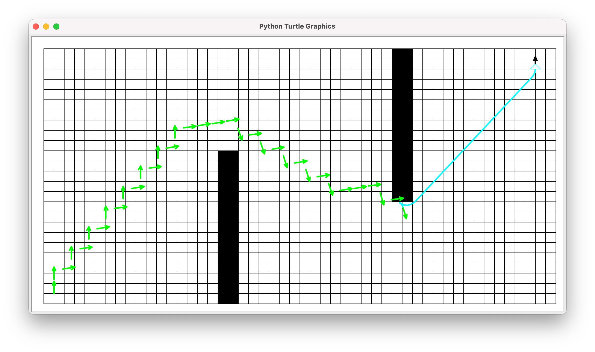
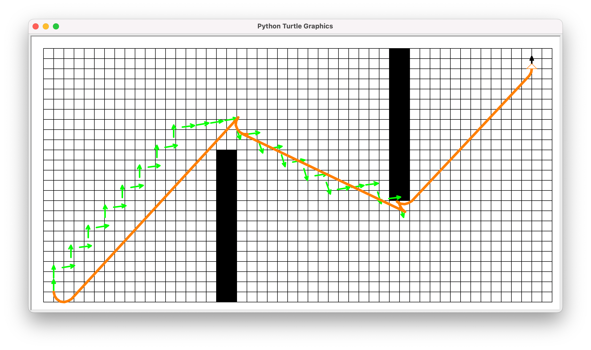

# HybridA*算法实现与可视化（课程project）
方案：A* + Reeds-Shepp曲线 + 优先队列 + 字典

# Screenshots

# 参考了以下开源仓库
- [nathanlct/reeds-shepp-curves](https://github.com/nathanlct/reeds-shepp-curves) - Copyright (c) 2019 Nathan Lichtlé
